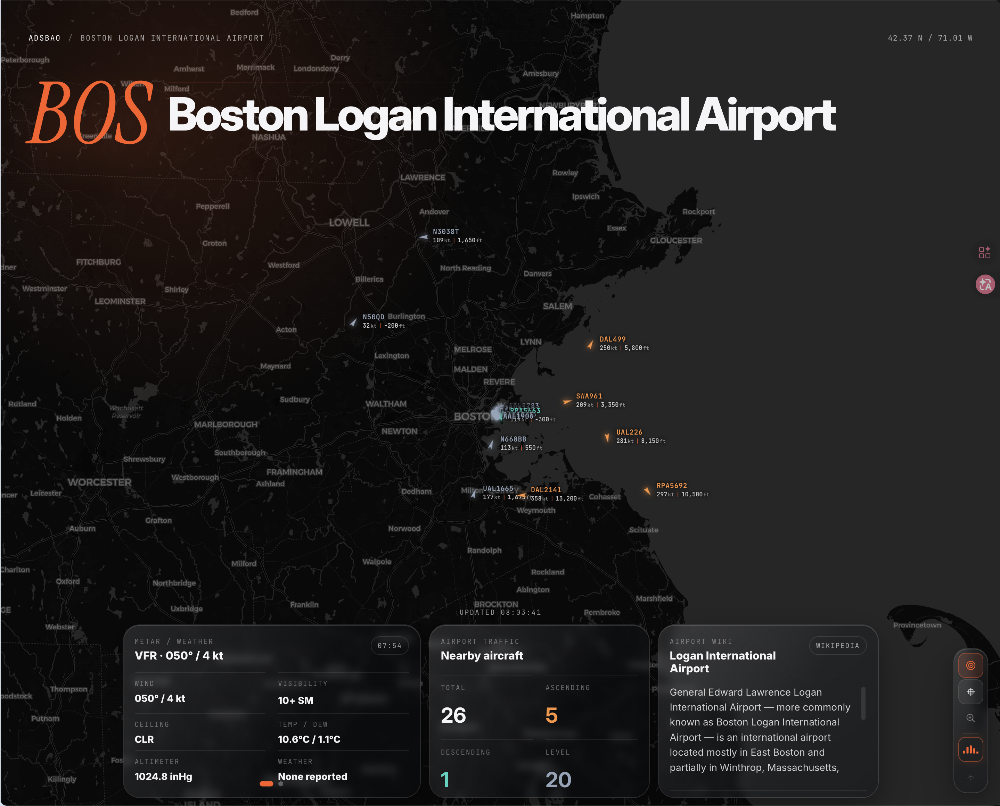

# ADSBao

A modern airport-monitoring HUD with dynamic airport search, METAR context, and nearby aircraft overlays.



## Overview
ADSBao provides a search-first airport operations view with weather context and aircraft position overlays. Airport search is backed by public airport directory data.

Current web app version: **0.8.0**. See `CHANGELOG.md` for product version history and the legacy desktop release split.

## Tech Stack
- **Frontend**: React on Next.js App Router, Tailwind CSS v4, DaisyUI, Lucide Icons.
- **Vercel UX integrations**: Vercel Web Analytics and Speed Insights use their Next.js packages.
- **Component migration**: Former VueBits-style effects are implemented as React components.
- **Data access**: Browser-managed airport directory requests to airportsapi.com, with conservative client caching.
- **Vercel routing**: Same-origin Vercel rewrites for AviationWeather METAR and adsb.lol aircraft positions, plus a Vercel serverless function for callsign route lookup.
- **Typography**: Google Sans Flex & Google Sans Code.

## Getting Started

### Prerequisites
- Node.js 24+ & [pnpm](https://pnpm.io/installation)

### Frontend Setup
```bash
pnpm install
pnpm run dev
```

The dev server starts on `http://localhost:3000` unless that port is already in use.

### Vercel Web Deployment
The repo includes `vercel.json` for Git-triggered Vercel builds with same-origin data paths for browser-blocked upstream data.

```bash
vercel
```

The deployment path intentionally keeps upstream ownership visible: airport search goes to airportsapi.com from the browser, `/api/proxy/metar/:icao` rewrites to AviationWeather, `/api/proxy/aircraft/positions/:lat/:lon/:dist` rewrites to adsb.lol, and `/api/proxy/flight-routes/callsign/:callsign` routes through the Next.js Route Handler.

---

## Contributing

We welcome contributions! Here's how to set up the development environment:

### Prerequisites
- Node.js 24+ with [pnpm](https://pnpm.io/installation)
- Git

### Running locally

**1. Clone the repo**
```bash
git clone https://github.com/orriduck/ADSBao.git
cd ADSBao
```

**2. Start the frontend**
```bash
pnpm install                     # install Node dependencies
pnpm run dev                     # Next.js dev server with HMR
```
Frontend available at `http://localhost:3000` by default.

### Project structure
```
ADSBao/
├── docs/             # Architecture and release notes
├── src/
│   ├── app/          # Next.js App Router pages and route handlers
│   ├── components/
│   ├── hooks/
│   ├── constants/
│   └── services/
├── package.json
└── vercel.json       # Vercel deployment config
```

## External Data Use
ADSBao uses public aviation data sources and avoids intentionally high-volume polling. The aircraft overlay polls every 15 seconds by default, and airport directory results are cached in the browser for six hours. See `docs/architecture.md` for endpoint decisions, Vercel routing, and release-line context.

## Release Policy
Vercel deploys every push to `main`, but deployments are not product releases. Product versions are bumped only when user-visible product scope changes, production behavior changes, or fixes should be documented in `CHANGELOG.md`.
